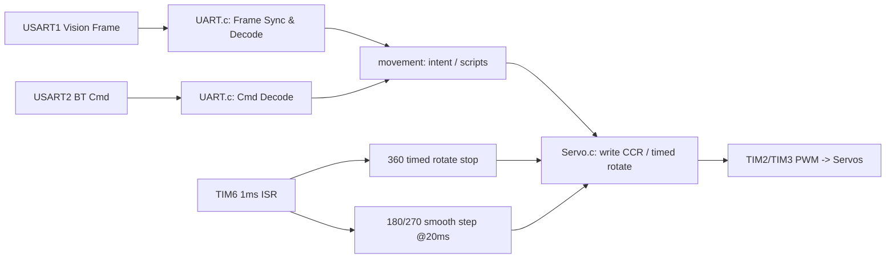

# Project — STM32F407 机械臂控制（视觉自动 + 蓝牙手动）

> 本仓库是一个基于 **STM32F407ZGTx**（HAL/CubeMX）实现的机械臂控制工程：  
>
> - **自动模式（Vision / USART1）**：接收 *7字节定长帧*（`0xAA ... 0xFF`）并驱动舵机  
> - **手动模式（Bluetooth / USART2）**：接收 *单字节命令* 实现“按住移动 / 松手停止”  
> - **TIM6 1ms 节拍器**：负责 360°连续旋转“计时转角”和 180/270 舵机 20ms 平滑推进

---

## 目录

- [功能特性](#功能特性)
- [快速开始](#快速开始)
- [硬件与接线](#硬件与接线)
- [软件架构](#软件架构)
- [协议说明](#协议说明)
- [参数与调参](#参数与调参)
- [FAQ](#faq)
- [许可证](#许可证)

---

## 功能特性

- **双串口输入**
    - USART1：视觉/上位机定长帧（自动模式）
    - USART2：蓝牙命令（手动模式）
- **两种模式可切换**
    - `mode_flag == 1`：自动模式（视觉帧生效）
    - `mode_flag == 2`：手动模式（蓝牙命令生效）
- **手动抢占（Manual Override）**
    - 任何蓝牙命令到来会置 `g_manual_override=1`，可打断自动长动作流程（如 demo）
- **PWM 输出（50Hz / 20ms）**
    - TIM2 / TIM3：`Prescaler=84-1`，`Period=20000-1` → **1MHz 计数**，CCR 单位≈**微秒**
- **平滑推进（抑抖 + 限速）**
    - 180°/270°舵机以 20ms 周期推进到目标脉宽（限速 step / deadband / quantize）
- **可扩展外设**
    - 工程内包含 IMU（MS6DSV）驱动、按键、GPIO 等模块（部分功能在 main.c 中默认注释）

---

## 快速开始

### 1) 选择工具链

本工程同时保留了：

- **STM32CubeMX 工程文件**：`Project/Project.ioc`
- **Keil MDK 工程**：`Project/MDK-ARM/Project.uvprojx`
- CubeIDE 也可直接导入（如果你用 CubeMX 生成过 CubeIDE 工程）

> 你只需要选一种方式编译/下载即可。

### 2) 编译与烧录（推荐 CubeIDE）

1. 打开 STM32CubeIDE  
2. `File -> Import -> Existing Projects into Workspace`
3. 选择 `Project6/` 目录导入
4. Build
5. 连接 ST-Link → Run/Debug 下载

### 3) 编译与烧录（Keil）

1. 打开 `Project/MDK-ARM/Project.uvprojx`
2. 选择对应芯片（STM32F407ZGTx）
3. Build / Download

---

## 硬件与接线

> 来自工程内 `引脚.txt`（仓库根目录下 `Project/#引脚.txt`）

### 舵机 PWM

| 舵机            | 类型         | 定时器通道 | 引脚 |
| --------------- | ------------ | ---------- | ---- |
| 第一关节 / 底座 | 360°连续旋转 | TIM2_CH2   | PA1  |
| 第二关节        | 270°舵机     | TIM2_CH3   | PA2  |
| 第三关节 / 夹爪 | 180°舵机     | TIM3_CH2   | PA7  |

### 蓝牙串口（USART2）

| 蓝牙模块 | STM32 引脚      | 说明                          |
| -------- | --------------- | ----------------------------- |
| RX       | PD5 (USART2_TX) | 蓝牙 RX 接 MCU TX             |
| TX       | PD6 (USART2_RX) | 蓝牙 TX 接 MCU RX             |
| VCC      | 5V              | 视模块而定（注意与 MCU 共地） |

- USART2 参数：`9600 8N1`

### 视觉/上位机串口（USART1）

- 引脚：PA9 (TX)、PA10 (RX)
- 串口参数：`115200 8N1`

### 按键与 GPIO

| 功能               | 引脚            |
| ------------------ | --------------- |
| Key1 / Key2 / Key3 | PF6 / PF7 / PF8 |
| GPIO 输出          | PF3 / PF4       |

### IMU（可选：MS6DSV）

| 信号          | 引脚        |
| ------------- | ----------- |
| SD0           | PC0         |
| INT           | PC1         |
| I2C SCL / SDA | PB10 / PB11 |
| VCC           | 3.3V        |

> ⚠️ **强烈建议**：舵机独立 5V 大电流供电，并与 STM32 **共地**，否则可能复位/抖动。

---

## 软件架构

工程主要逻辑分成四层（从“输入”到“执行”）：

1. **UART 输入层（中断回调）**  
    - `HAL_UART_RxCpltCallback()`（在 `HardWare/UART.c`）  
    - USART1：字节流 → 帧同步 → 7字节定长帧  
    - USART2：单字节命令 → 动作译码

2. **动作语义层（movement）**  
    - `HardWare/control/movement.c`  
    - 把“底座转动、关节角度、夹爪开合”封装成可调用的语义接口  
    - 可组织演示动作脚本（startup / demo）

3. **执行层（Servo）**  
    - `HardWare/control/Servo.c`  
    - 将“角度/速度意图”转换为 **PWM 脉宽（CCR）**，并输出到 TIM2/TIM3

4. **节拍调度层（TIM6 / Timer）**  
    - `HardWare/SYS/Timer.c`  
    - TIM6 1ms 中断承担：
        - 360 连续旋转 “计时转角” 到点停止
        - 180/270 舵机每 20ms 平滑推进
        - 10ms 产生 `g_data_update_flag` 给主循环刷新（可选）

### 架构图

---

## 协议说明

### A) 视觉帧（USART1，7字节定长）

帧格式（`HardWare/UART.c` 顶部注释有对应说明）：

| Byte0  | Byte1 | Byte2 | Byte3    | Byte4    | Byte5 | Byte6  |
| ------ | ----- | ----- | -------- | -------- | ----- | ------ |
| `0xAA` | `cw`  | `ccw` | `raw270` | `raw180` | `sel` | `0xFF` |

#### 1) cw / ccw（360°连续旋转）

- 设计思想：视觉侧输出两个方向的“转动量”
- 安全策略：代码中只允许 **单方向非零**（`cw>0 XOR ccw>0`），否则视为无效 → `stop`

> 连续旋转舵机本质是“速度舵机”，工程使用“计时到点 STOP”的开环方式实现“转多少”。

#### 2) raw270（第二关节 270°）

- 工程映射：`angle = 105 + raw270`（随后 clamp 到安全范围）
- 你可以按机械结构调整映射区间（见 [参数与调参](#参数与调参)）

#### 3) raw180（夹爪 180°）

- 工程中将其当作角度输入，并限制到 `[0, 140]`（避免机械干涉）

#### 4) sel（本帧控制选择位）

工程中 `sel` 用于决定本帧控制哪些舵机：

|    sel | 含义      |
| -----: | --------- |
| `0x01` | 仅 360    |
| `0x02` | 仅 270    |
| `0x03` | 仅 180    |
| `0x04` | 360 + 270 |
| `0x05` | 360 + 180 |
| `0x06` | 270 + 180 |
| `0x07` | 全停      |

兼容：工程中还保留了对旧视觉帧的兼容逻辑（例如某些特定组合表示 stop）。

---

### B) 蓝牙命令（USART2，单字节）

> 命令由 `process_bluetooth_command()` 解析（`HardWare/UART.c`）

常用命令（按“按住/松手”交互设计）：

|    Cmd | 动作        | 交互语义     |
| -----: | ----------- | ------------ |
| `0x01` | 底座正向转  | 按住持续转   |
| `0x02` | 底座反向转  | 按住持续转   |
| `0x07` | 底座停止    | 松手停止     |
| `0x03` | 270关节 +   | 按住持续移动 |
| `0x04` | 270关节 -   | 按住持续移动 |
| `0x08` | 270关节停止 | 松手冻结     |
| `0x05` | 夹爪张开    | 按住持续移动 |
| `0x06` | 夹爪闭合    | 按住持续移动 |
| `0x09` | 夹爪停止    | 松手冻结     |
| `0x10` | GPIO ON     | 示例外设开   |
| `0x11` | GPIO OFF    | 示例外设关   |

---

## 参数与调参

本工程“可调”的关键参数集中在：

### 1) 舵机 PWM/速度常量（`HardWare/control/Servo.h`）

- `STOP`：连续旋转舵机停止脉宽（默认 1500us）
- `SPEED_*`：连续旋转的不同速度档（根据你的舵机校准）

> 不同舵机的停止点可能不是精确 1500us，需要实际标定。

### 2) 平滑推进参数（`HardWare/SYS/Timer.h`）

- 180°夹爪：
    - `CLAW_SMOOTH_STEP_US` / `CLAW_DEADBAND_US` / `CLAW_QUANT_US`
- 270°关节：
    - `JOINT2_SMOOTH_STEP_US` / `JOINT2_DEADBAND_US` / `JOINT2_QUANT_US`

调参建议：

- 想更平滑：减小 `STEP_US`，适当增大 `DEADBAND_US`
- 想更快：增大 `STEP_US`
- 末端抖动明显：增大 `QUANT_US` 或 `DEADBAND_US`

---

## FAQ

### 1) 为什么 360°“按角度转动”不准？

连续旋转舵机没有角度反馈，本工程用“假设转速恒定 + 计时停止”是 **开环近似**：电压/负载变化都会影响精度。  
要高精度角度控制，需要编码器/IMU/视觉闭环等反馈。

### 2) 为什么平滑推进用 20ms？

舵机 PWM 通常 50Hz（周期 20ms），按同周期更新 CCR 更稳定，抖动更小。

### 3) 为什么不要在串口中断里疯狂 printf？

阻塞发送会拉长中断执行时间，可能导致丢字节/抖动。建议只在调试阶段开启，或降低频率。

---

## 许可证

- `LICENSE`：MIT
